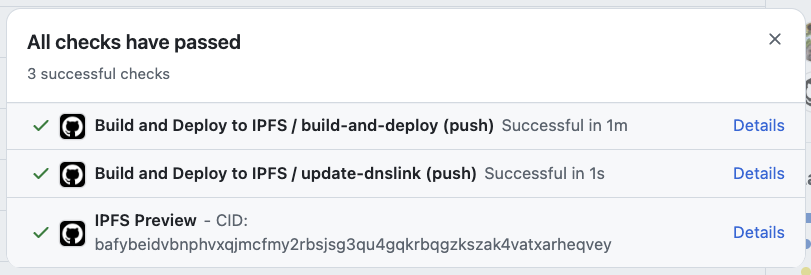
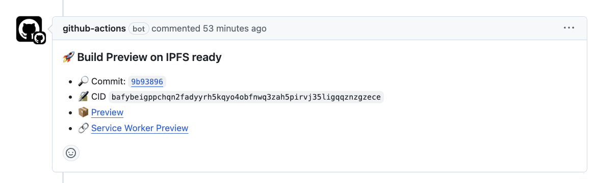

# Deploy to IPFS Action

This GitHub Action automates the deployment of static sites to IPFS using [CAR files](https://docs.ipfs.tech/concepts/glossary/#car). It pins to either Kubo, IPFS Cluster, or [Storacha](https://storacha.network), as well as supporting additional pinning to [Pinata](https://pinata.cloud). The action will automatically create a preview link and update your PR/commit status with the deployment information.

This action is built and maintained by [Interplanetary Shipyard](http://ipshipyard.com/).
<a href="http://ipshipyard.com/"></a>

The [composite action](https://docs.github.com/en/actions/sharing-automations/creating-actions/about-custom-actions#composite-actions) makes no assumptions about your build process. You should just run your build and then call this action (as a step in an existing job) with the `path-to-deploy` input set to the path of your build output directory.





## Features

- 📦 Merkleizes your static site into a CAR file
- 🚀 Uploads CAR file to either Storacha, IPFS Cluster, or Kubo
- 📍 Optional pinning to Pinata
- 💾 Optional CAR file upload to Filebase
- 📤 CAR file attached to Github Action run Summary page
- 🔗 Automatic preview links
- 💬 Optional PR comments with CID and preview links
- ✅ Optional commit status updates with build CID

## How does this compare to the other IPFS actions?

This action encapsulates the established best practices for deploying static sites to IPFS in 2025

- Merkleizes the build into a CAR file in GitHub Actions using `ipfs-car`. This ensures that the CID is generated in the build process and is the same across multiple providers.
- Uploads the CAR file to IPFS via [Storacha](https://storacha.network).
- Optionally pins the CID of the CAR file to Pinata. This is useful for redundancy (multiple providers). The pinning here is done in the background and non-blocking. (When pinning, Pinata will fetch the data from Storacha.)
- Updates the PR/commit status with the deployment information and preview links.

## Storacha configuration

To set up the Storacha, you will need to install [w3cli](https://github.com/storacha/w3cli) and login with your Storacha account.

Once logged in:

- [Create a new space](https://docs.storacha.network/how-to/ci/#create-a-space) (like an S3 bucket) to which you will upload the merkleized CAR files.
- [Create a signing key](https://docs.storacha.network/how-to/ci/#create-a-signing-key) that will be used in CI to sign requests to Storacha.
- [Create a UCAN proof](https://docs.storacha.network/how-to/ci/#create-a-proof) that will be used in CI to sign requests to Storacha.

The signing key and proof will be used as [inputs](#inputs) to the action.

## Inputs

### Required Inputs

| Input              | Description                                                                                                                                                                                                  |
| ------------------ | ------------------------------------------------------------------------------------------------------------------------------------------------------------------------------------------------------------ |
| `path-to-deploy`   | Path to the directory containing the frontend build to merkleize into a CAR file and deploy to IPFS                                                                                                          |
| `github-token`     | GitHub token for updating commit status and PR comments                                                                                                                                                      |
| `kubo-api-url`     | Kubo RPC API URL to pass to `ipfs --api`, e.g. `/dns/YOUR_DOMAIN/tcp/443/https`                                                                                                                              |
| `kubo-api-auth`    | Kubo RPC API auth secret to pass to `ipfs --api-auth`, e.g. `basic:hello:world` (defined as `AuthSecret` in `API.Authorizations` config)                                                                     |
| `cluster-url`      | IPFS Cluster URL to pass to `ipfs-cluster-ctl --host`                                                                                                                                                        |
| `cluster-user`     | IPFS Cluster username for basic http auth                                                                                                                                                                    |
| `cluster-password` | IPFS Cluster password for basic http auth                                                                                                                                                                    |
| `storacha-key`     | Storacha base64 encoded key to use to sign UCAN invocations. Create one using `w3 key create --json` (and use `key` from the output). See: https://github.com/storacha/w3cli#w3_principal                    |
| `storacha-proof`   | Storacha Base64 encoded proof UCAN with capabilities for the space. Create one using `w3 delegation create did:key:DID_OF_KEY -c space/blob/add -c space/index/add -c filecoin/offer -c upload/add --base64` |

> [!IMPORTANT]
> To use this action, you must configure the inputs for either: **Kubo, IPFS Cluster, or Storacha**.
>
> - Kubo: `kubo-api-url` and `kubo-api-auth`
> - IPFS Cluster: `cluster-url`, `cluster-user`, `cluster-password`
> - Storacha: `storacha-key`, `storacha-proof`
>
> Pinata can only be used in addition (but not exclusively) to the above providers/nodes. This may change in the future if Pinata adds support for CAR uploads.

### Optional Inputs

| Input                     | Description                                                                                                                                         | Default                                    |
| ------------------------- | --------------------------------------------------------------------------------------------------------------------------------------------------- | ------------------------------------------ |
| `node-version`            | Node.js version to use                                                                                                                              | `'20'`                                     |
| `cluster-ctl-version`     | IPFS Cluster CLI version to use                                                                                                                     | `'v1.1.2'`                                 |
| `kubo-version`            | Kubo CLI version to use for pinning API and CAR uploads                                                                                             | `'v0.33.0'`                                |
| `ipfs-add-options`        | Options to pass to `ipfs add` command that is used to merkleize the build. See [ipfs add docs](https://docs.ipfs.tech/reference/kubo/cli/#ipfs-add) | `'--cid-version 1 --chunker size-1048576'` |
| `pinata-pinning-url`      | Pinata Pinning Service URL                                                                                                                          | `'https://api.pinata.cloud/psa'`           |
| `pinata-jwt-token`        | Pinata JWT token for authentication                                                                                                                 | -                                          |
| `filebase-bucket`         | Filebase bucket name                                                                                                                                | -                                          |
| `filebase-access-key`     | Filebase access key                                                                                                                                 | -                                          |
| `filebase-secret-key`     | Filebase secret key                                                                                                                                 | -                                          |
| `set-github-status`       | Set GitHub commit status with build CID. Use "true" or "false" (as strings)                                                                         | `'true'`                                   |
| `set-pr-comment`          | Set PR comments with IPFS deployment information. Use "true" or "false" (as strings)                                                                | `'true'`                                   |
| `upload-car-artifact`     | Upload and publish the CAR file on GitHub Action Summary pages                                                                                      | `'true'`                                   |
| `cluster-retry-attempts`  | Number of retry attempts for IPFS Cluster uploads                                                                                                   | `'5'`                                      |
| `cluster-timeout-minutes` | Timeout in minutes for each IPFS Cluster upload attempt                                                                                             | `'2'`                                      |
| `cluster-pin-expire-in`   | Time duration after which the pin will expire in IPFS Cluster (e.g. 720h for 30 days). If unset, the CID will be pinned with no expiry.             | -                                          |
| `pin-name`                | Custom name for the pin. If unset, defaults to "{repo-name}-{commit-sha-short}" for both IPFS Cluster and Pinata.                                   | -                                          |

## Outputs

| Output | Description                          |
| ------ | ------------------------------------ |
| `cid`  | The IPFS CID of the uploaded content |

## Usage

See the [IPNS Inspector](https://github.com/ipfs/ipns-inspector/blob/main/.github/workflows/build.yml) for a real-world example of this action in use.

Here's a basic example of how to use this action in your workflow:

```yaml
name: Build and Deploy to IPFS

permissions:
  contents: read
  pull-requests: write
  statuses: write
on:
  push:
    branches:
      - main
  pull_request:

jobs:
  build-and-deploy:
    runs-on: ubuntu-latest
    outputs: # This exposes the CID output of the action to the rest of the workflow
      cid: ${{ steps.deploy.outputs.cid }}
    steps:
      - name: Checkout code
        uses: actions/checkout@v4

      - name: Setup Node.js
        uses: actions/setup-node@v4
        with:
          node-version: '20'
          cache: 'npm'

      - name: Install dependencies
        run: npm ci

      - name: Build project
        run: npm run build

      - uses: ipfs/ipfs-deploy-action@v1
        name: Deploy to IPFS
        id: deploy
        with:
          path-to-deploy: out
          storacha-key: ${{ secrets.STORACHA_KEY }}
          storacha-proof: ${{ secrets.STORACHA_PROOF }}
          github-token: ${{ github.token }}
```

## FAQ

- What's the difference between uploading a CAR and using the Pinning API?
  - Since the CAR is like a tarball of the full build with some additional metadata (merkle proofs), the upload will be as big as the build output. Pinning with the [Pinning API](https://github.com/ipfs/pinning-services-api-spec) in contrast is just a request to instruct the pinning service to retrieve and pin the data. At the time this action is first released, CAR uploads is supported by Kubo, Storacha, and Filebase, but not Pinata.
- How can I update DNSLink?
  - See https://github.com/ipfs/dnslink-action as a complement to this action.
